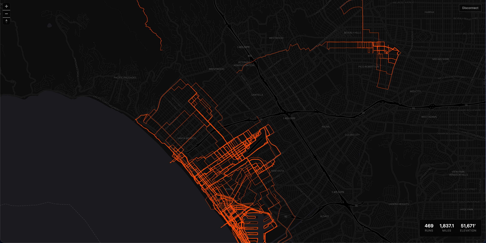

# Strava Route Overlay

All your runs on one map. Authenticates with Strava and renders every recorded run as an overlaid polyline on a dark map, color-coded by year.



## Features

- Interactive map with all runs overlaid as polylines, color-coded by year
- Stats card (total runs, miles, elevation)
- Demo mode at `/demo` — no login required, served from pre-fetched data

## Stack

- Next.js 15, TypeScript, Tailwind CSS
- MapLibre GL JS + OpenFreeMap (dark tiles)
- NextAuth.js (Strava OAuth)

## Demo data

To refresh the demo snapshot:

```
STRAVA_DEMO_REFRESH_TOKEN=<your_refresh_token> npm run fetch-demo
```

Requires `STRAVA_CLIENT_ID` and `STRAVA_CLIENT_SECRET` in `.env.local`.